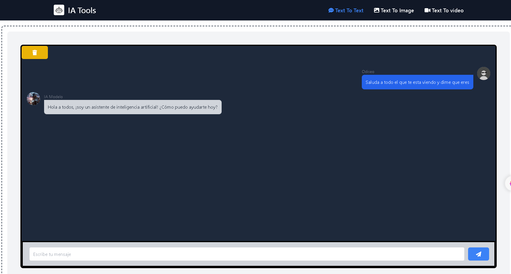
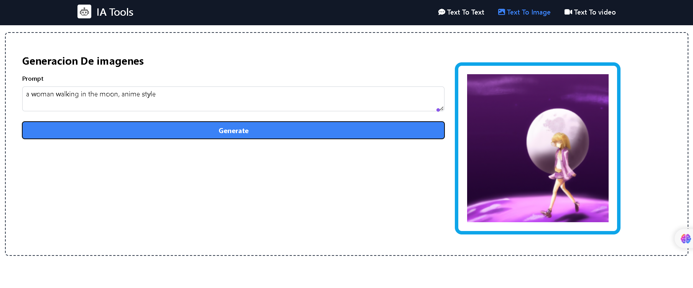
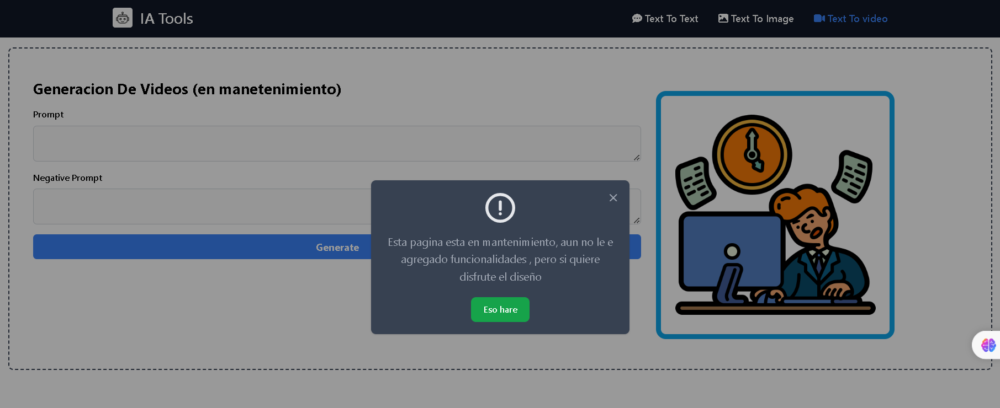

# IA Tools

En este proyecto uso tailwind para el diseño y tambien uso 2 IA gratuitas para la generacion de texto y de imagenes con la biblioteca gratuita useLLM

## Texto a Texto

## Texto a Imagen

>[!WARNING]
>Esta parte aun esta en mantenimiento y no tiene ninguna funcionalidad

## Texto a Video (en Mantenimiento)

